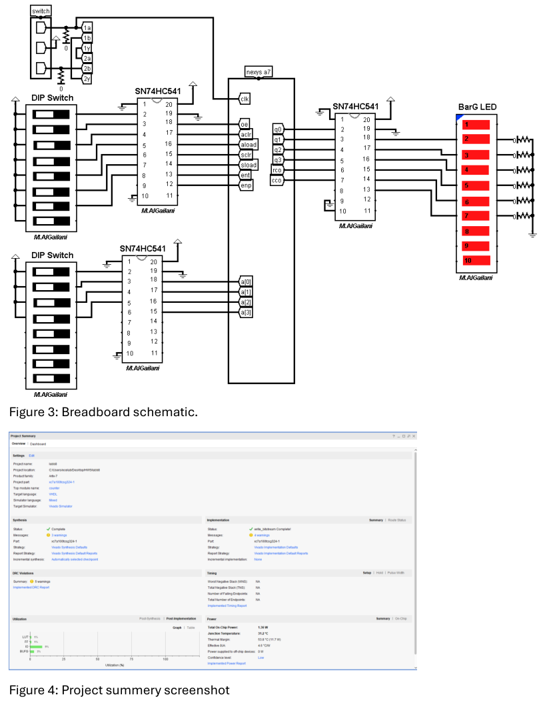
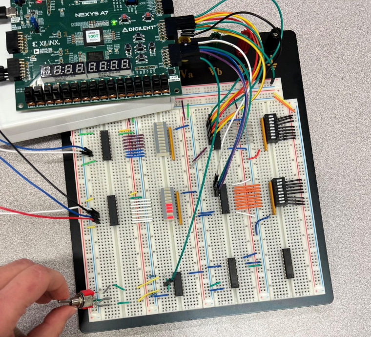
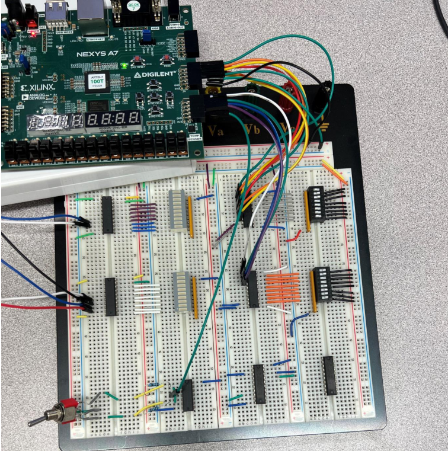
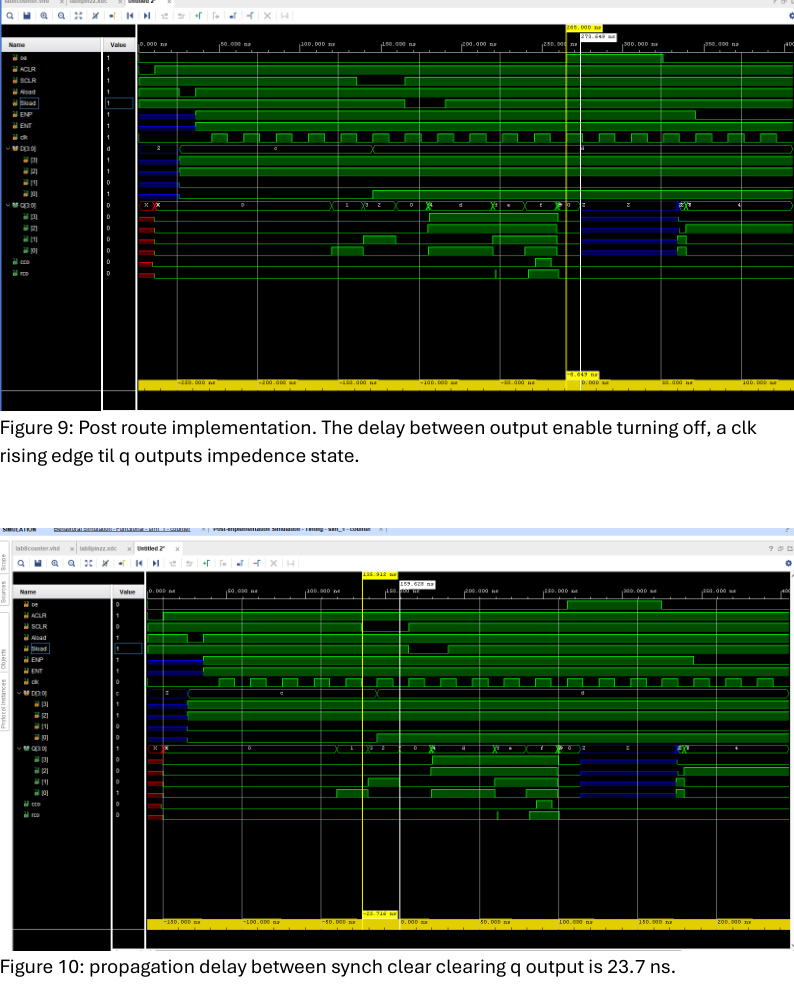
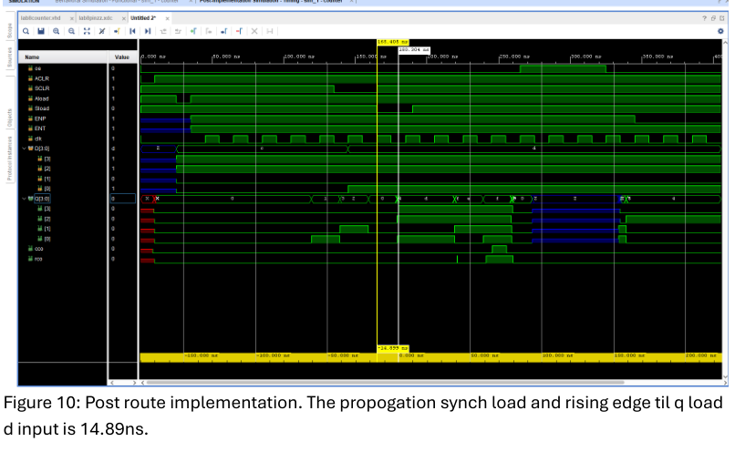

# SN74ALS561‑Style 4‑Bit Synchronous Counter (Tri‑State Outputs)

This lab is basically: “make the FPGA behave like a real counter IC.”
The goal was to design, simulate, and implement a **synchronous 4‑bit binary counter with 3‑state outputs** (SN74ALS561‑equivalent), then verify it in **post‑route timing simulation** and on real **hardware** (Nexys A7).

---

## Repo description (GitHub description box)

Synchronous 4‑bit universal counter (SN74ALS561‑equivalent) in VHDL on Nexys A7 with tri‑state Q outputs, post‑route timing verification, and hardware validation using DIP switches + LED display.

---

## What this counter supports

Inputs / controls (mirrors the chip behavior):
- **Count enable:** `ENP`, `ENT` (counting occurs when both are high)
- **Async clear:** `ACLR` (active low)
- **Async load:** `Aload` (active low, loads `D`)
- **Sync clear:** `SCLR` (active low, on rising clock edge)
- **Sync load:** `Sload` (active low, on rising clock edge)
- **Tri‑state output enable:** `oe` (when high, `Q` goes Hi‑Z)
- **Data input:** `D[3:0]`, **Outputs:** `Q[3:0]`, plus `rco` / `cco`

---

---

## Schematic + implementation photos

### Breadboard schematic + Vivado project summary


### Hardware verification (examples)
  
  
  


---

## Timing / post‑route simulation

Post‑route timing checks captured in the report:
- **OE disable → Q goes Hi‑Z after a clock edge**
- **Sync clear → Q clears**: ~**23.7 ns**
- **Sync load → Q loads D**: ~**14.89 ns**




---

## Code snippets (from the appendix)

### Core counter behavior (count / loads / clears)

```vhdl
if ACLR = '0' then
  acount <= "0000";
elsif Aload = '0' then
  acount <= D;
elsif rising_edge(clk) then
  if ENP = '1' and ENT = '1' and Sload = '1' and SCLR = '1'
     and Aload = '1' and ACLR = '1' then
    acount <= acount + 1;
  elsif SCLR = '0' then
    acount <= "0000";
  elsif Sload = '0' then
    acount <= D;
  elsif ENP = '0' then
    acount <= acount;
  end if;
end if;
```

### Tri‑state Q outputs

```vhdl
if oe = '0' then
  Q <= acount;
else
  Q <= (others => 'Z');
end if;
```

### RCO / CCO behavior

```vhdl
if acount = 15 then
  rco <= '1';
  rco_in <= '1';
else
  rco <= '0';
  rco_in <= '0';
end if;

process(clk)
begin
  if rco_in = '1' and clk = '0' then
    cco <= '1';
  else
    cco <= '0';
  end if;
end process;
```

---

## Simulation (Tcl force pattern)

```tcl
restart
add_force oe   {0 0ns}
add_force ACLR {0 0ns}
add_force SCLR {1 0ns}
add_force Aload {1 0ns}
add_force Sload {1 0ns}
add_force clk  {0 0ns}
run 10ns
add_force ACLR {1 0ns}
...
add_force clk {0 0ns} {1 10ns} -repeat_every 20ns
```

---

## XDC notes (pin mapping)

```tcl
# Data inputs (JB)
set_property -dict { PACKAGE_PIN D14 IOSTANDARD LVCMOS33 } [get_ports { D[0] }]
set_property -dict { PACKAGE_PIN F16 IOSTANDARD LVCMOS33 } [get_ports { D[1] }]
set_property -dict { PACKAGE_PIN G16 IOSTANDARD LVCMOS33 } [get_ports { D[2] }]
set_property -dict { PACKAGE_PIN H14 IOSTANDARD LVCMOS33 } [get_ports { D[3] }]

# Outputs (JC)
set_property -dict { PACKAGE_PIN K1 IOSTANDARD LVCMOS33 } [get_ports { Q[0] }]
set_property -dict { PACKAGE_PIN F6 IOSTANDARD LVCMOS33 } [get_ports { Q[1] }]
set_property -dict { PACKAGE_PIN J2 IOSTANDARD LVCMOS33 } [get_ports { Q[2] }]
set_property -dict { PACKAGE_PIN G6 IOSTANDARD LVCMOS33 } [get_ports { Q[3] }]
```

---

## Run it (Vivado)

1. Create a Vivado project targeting **Nexys A7**.
2. Add `src/counter.vhd` + your `.xdc`.
3. Run **implementation**, then **post‑implementation timing simulation**.
4. Program the FPGA and verify the control cases using the same switch patterns shown in the photos.

---

## Report

See `report/ECE4525 Lab 8 Report.pdf` for the full write-up and appendix code.
